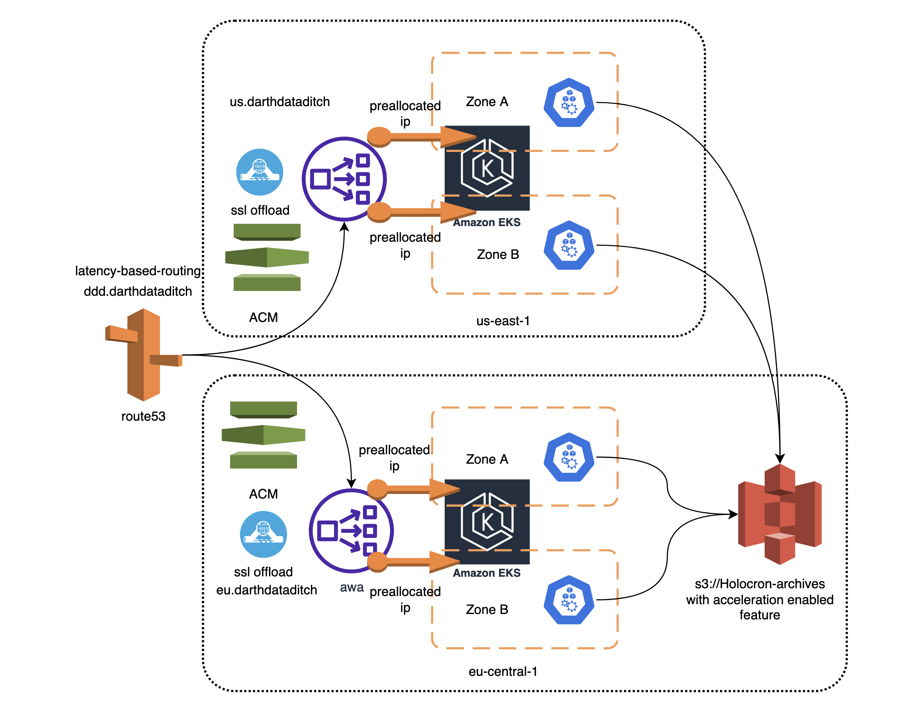

# DarthDataDitch General cosidirations
Infrastructure utilize AWS resources and fully builded in IaaC approach. For deploying it is assuming that you already have aws account with the admin rights. and manually provision bucket for terraform state in this case it is `jb-tt-tf-state`, this code provided fully ready solution to have 2 redundand EKS clusters in 2 regions in this case us-east-1 and eu-central-1. It is assuming that you already have doman or zone and able to delegate ti to Route53 (it should be done on the side of your internet domain registrar). Application called `DarthDataDitch` builded with python and dockerized. The deployment should be done by helm package manager. Everything here buided to be fault tollerant to one AWS AZ or Region outage. More things you can read [here](https://docs.google.com/document/d/1_5W-mnQ0Ws0bq8gDrwcKPqiczHOUIyRVEaWobPW_bQk/edit) This code builded keeping in mind availability to easy expand configuration to different AWS regions.

# DarthDataDitch Infrastructure
Detailed explanation of infrastructure [here](terraform/README.md)

# Building
## How to build
After infrastructure is fully ready, configure [build.sh](build.sh) and execute it.

# Deployment
After infrastructure is fully ready, configure [deployment.sh](helm/deployment.sh) and execute it. The detailed deployment doc is [here](helm/README.md) 

